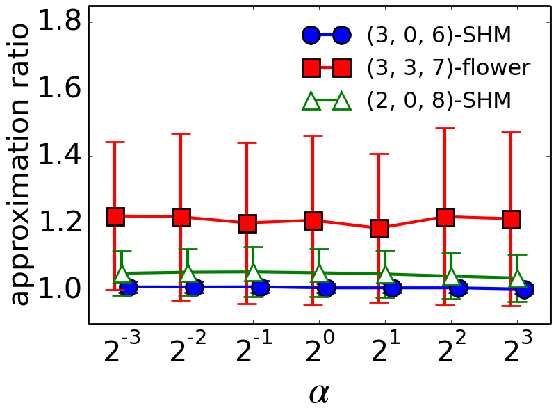
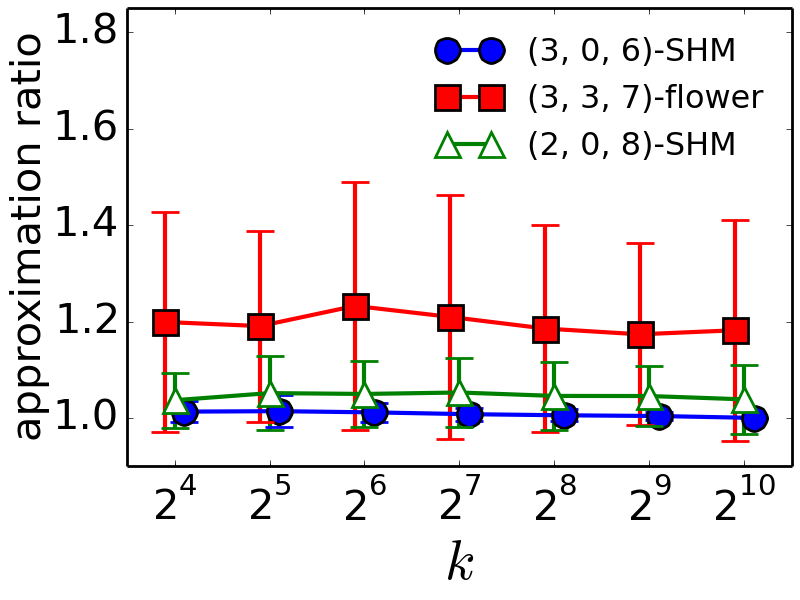
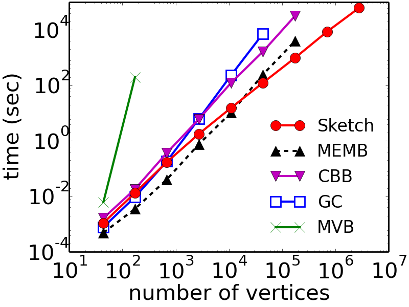
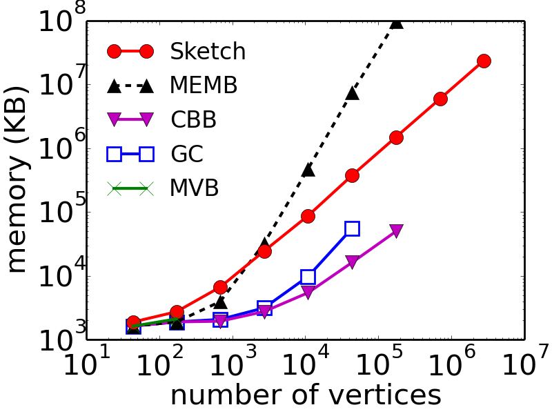
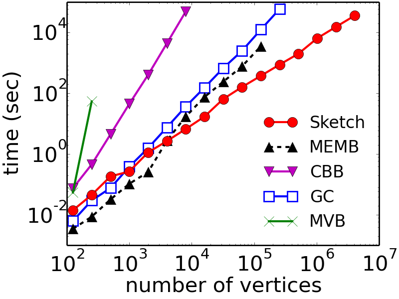
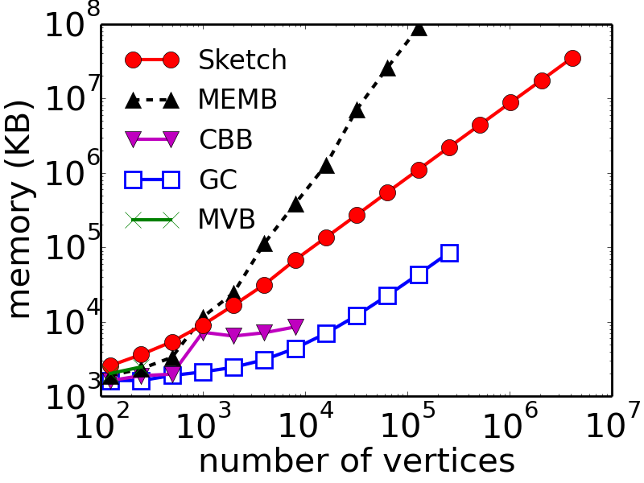
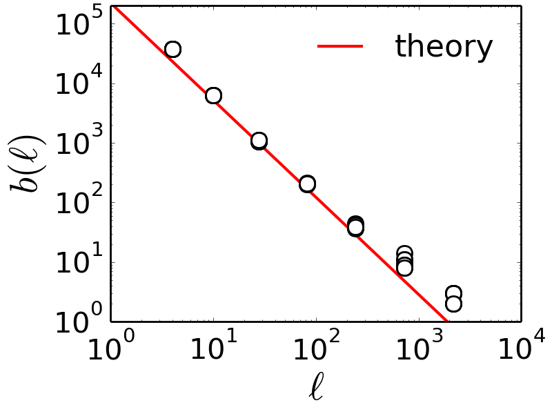
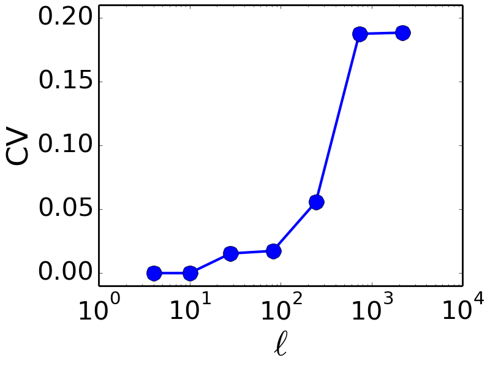

# box_cover
```
box_cover --force_undirected --type gen --graph "flower 2000 2 2" --rad_analytical --sketch_k 128 --upper_param 1.0 --pass 100000 --rad_max 100000 --final_coverage 1.0 --method sketch
```

|オプション||
|:--|:--|
|force_undirected|絶対つけよう|
|type|使用するグラフのファイルタイプ。生成させる場合は gen にする|
|exp_tag|実験管理タグ。JLOGファイル名の先頭に追加する文字列|
|final_coverage|Sketch の最終的なカバレッジ。デフォルトは1.0|
|method|使用するアルゴリズム。指定なしの場合は sketch になる。|
|pass|マルチパスのパス数。デフォルトは1|
|rad_analytical|flowerとSHMモデルの場合、解析解に必要な半径だけを使う。|
|rad_max|半径の最大値。デフォルトは10|
|rad_min|半径の最小値。デフォルトは1|
|sketch_k|sketchのk。デフォルトは128|
|upper_param|sketchのα。デフォルトは1.0|

## 使用可能なアルゴリズム
--method オプションで使用可能なアルゴリズム

|オプション|アルゴリズム|
|:--|:--|
|sketch|Sketch (Akiba et al. 2016)|
|memb|MEMB (Song et al. 2007)|
|coloring|Greedy Coloring (Song et al. 2007)|
|cbb|CBB (Song et al. 2007)|
|burning|Burning (Schneider et al. 2012)|
|analytical|flower または SHM モデルに限り解析解を返す|

# 解析用スクリプト

## Average Approximation Ratio
フラクタルなモデルのグラフの計算結果に対して、パラメータ k ごと、α ごとにそれぞれ分けて Average Approximation Ratio を計算してグラフを出力してくれる。ただし、モデルは解析解が埋め込みされているものしか計算できないので、予め埋め込んでおく必要がある。




```
./average-approximation-ratio.py [解析に使いたいJLOGファイルたち]
./average-approximation-ratio.py jlog/*
```
## フィッティング計算
各アルゴリズムの各グラフに対する結果について、exponentail と power-law な関数をそれぞれ非線形最小二乗法でフィッティングし、その二条誤差からどちらにより近いかを判定する。同じアルゴリズムかつ同じグラフの解析結果が複数含まれていた場合実行時間のより短かったほうが使用される。
```
./calc_residual.py [解析に使いたいJLOGファイルたち]
./calc_residual.py jlog/*
```

## jlog 統合
半径ごとに別々のジョブとして実行した場合、それぞれの半径について計算した結果がjlogとして出力されるが、combine_rads.pyによって統合できる。

```
./combine_rads.py [統合したjlogファイルたち]
./combine_rads.py jlog/sketch-hollywood-2011.agl-rad.*
```

## スケーラビリティ
各アルゴリズムのflowerとBAに対する実行時間・メモリ使用量をプロットする。





```
./scalability.py [スケーラビリティを計測するJLOGたち]
./scalability.py jlog/*
```

## ばらつき
同一アルゴリズムの同一グラフに対する実行ごとのばらつきをプロットする。直線としてプロットされている解析解は埋め込みしたもの。



```
./scatter_plot.py [同一アルゴリズムの同一グラフに対する計測結果のJLOGたち]
./scatter_plot.py sketch-flower-223950-3-3-*
```

# 可視化まわり
## 次数分布を出力
`./bin/box_cover` が出力した jlog ファイルをからグラフの次数分布をjlogに出力する。
```
./bin/degree_distribution --type agl --graph [グラフファイル] --force_undirected --jlog_file [box_cover が出力したjlogファイル] 
./bin/degree_distribution --type agl --graph hoge.agl --force_undirected --jlog_file hogehoge.jlog 
```
## 次数分布を描画
```
./degree_distribution_plot.py [degree_distributionが出した jlog ファイル]
./degree_distribution_plot.py degree_distribution.jlog
```

## 最大連結成分を抽出
最大連結成分を TSV にして出力する
```
./bin/largest_connected_tsv --type agl --graph [グラフファイル] --force_undirected > hoge.tsv
./bin/largest_connected_tsv --type agl --graph hoge.agl --force_undirected > hoge.tsv
```

## 座標の位置を固定しながら可視化
険しすぎ
```
./fractal_visualizer.py [グラフのtsvファイル（連結でなければダメ）] [box_cover が出力したjlogファイル]
./fractal_visualizer.py largest_connected.tsv box_cover.jlog
```
